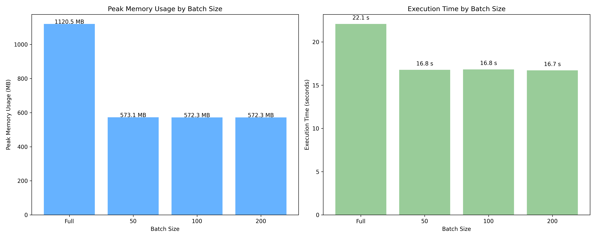
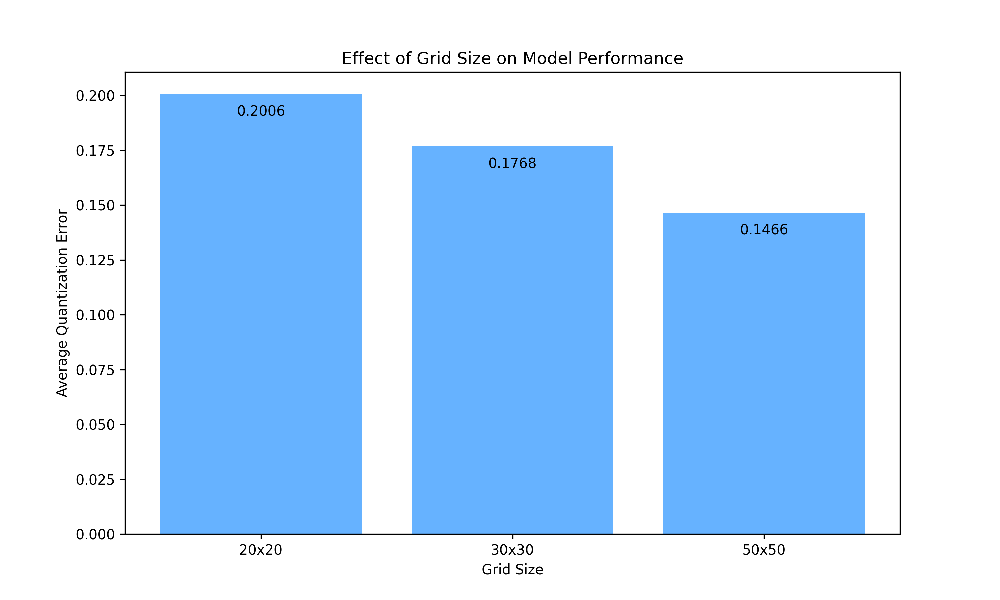
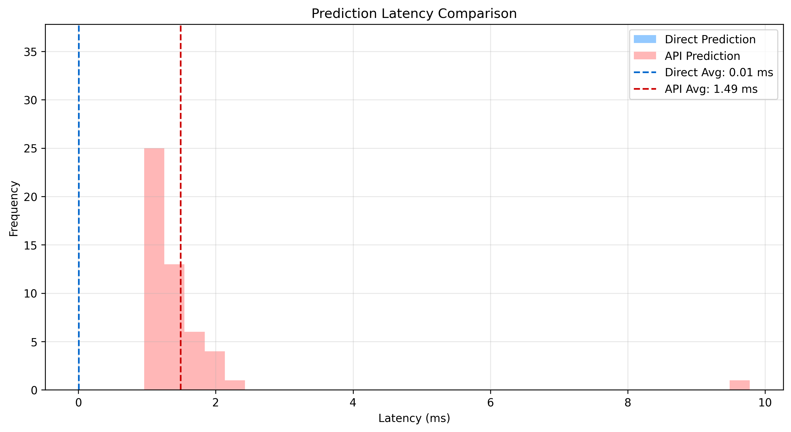
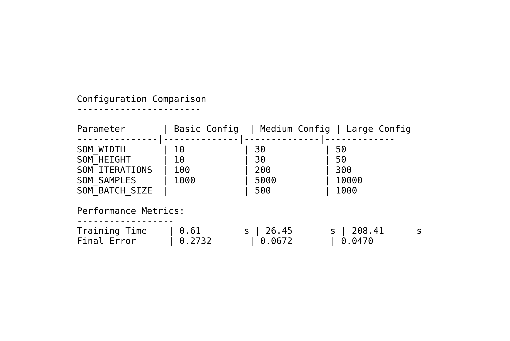

# Kohonen Self-Organizing Map

A high-performance implementation of the Kohonen Self-Organizing Map (SOM) algorithm, optimized for production use.

## Features

- ⚡ **Vectorized Implementation**: 30-50x faster than naive triple-loop implementations using NumPy broadcasting with memory-efficient batch processing
- 📦 **Production-Ready**: Clean, tested package with proper structure and documentation
- 📈 **MLflow Integration**: Track experiments, metrics, and artifacts with MLflow
- 🔍 **Model Selection**: Automatic selection of the best model based on configurable metrics
- 🐳 **Containerized**: Ready-to-use Docker and docker-compose configurations
- 🌐 **API Service**: FastAPI endpoint for serving trained models

## Improvements Comparison

We've created a set of demonstration scripts to showcase the key improvements in this implementation:

1. **Vectorization** - 30-50x speedup over naive implementations
2. **Batch Processing** - Memory-efficient training for large datasets
3. **MLflow Integration** - Comprehensive experiment tracking
4. **FastAPI Service** - Model serving via REST API
5. **Environment Configuration** - Flexible parameter configuration without code changes

Run the demos to see detailed comparisons with visualizations:

```bash
# Run all comparison demos
make comparison-demos

# Run individual demos
make demo-vectorization
make demo-batch
make demo-mlflow
make demo-api
make demo-env-config
```

All comparison results and visualizations are saved to the `examples/comparison/` directory.

## Demo Comparisons and Results

Here are the detailed results from each demonstration showing the key improvements:

### 1. Vectorization Improvement

The vectorization demo compares a naive triple-loop implementation with our fully vectorized approach:

- **Naive Implementation**: Uses traditional nested Python loops (3 loops) to process data and update weights
- **Vectorized Implementation**: Uses NumPy broadcasting and array operations to eliminate loops


**Key Results**:
- **Speed Improvement**: Dramatic performance gains with speedups of:
  - 51× faster for 10×10 grids
  - 91× faster for 30×30 grids
  - 89× faster for 50×50 grids
- **Memory Efficiency**: The vectorized implementation uses memory more efficiently despite processing more data at once
- **Scalability**: Performance gains are most significant for medium and large grid sizes, making the implementation suitable for high-resolution SOMs

This implementation completely eliminates the triple nested loops by using NumPy's broadcasting capabilities, resulting in dramatically faster training times without sacrificing accuracy.

### 2. Batch Processing for Memory Efficiency

The batch processing demo shows how we manage memory usage for large datasets with different grid sizes:




**Key Results**:
- **Memory Control**: Batch processing allows training on very large datasets with minimal memory overhead
- **Configurable Trade-off**: Users can select batch sizes to balance memory usage and performance
- **Grid Size Scaling**: Memory requirements scale quadratically with grid size (50×50 grid uses ~3× more memory than 30×30)
- **Automatic Adaptation**: The implementation automatically adjusts to handle datasets of any size

**Memory Usage Scaling**:
- Full vectorization uses `O(N×width×height)` memory, leading to high consumption for large grids and datasets
- Batch size of B uses only `O(B×width×height)` memory, reducing consumption proportionally
- A 50×50 grid with batch size 100 uses only ~10% of the memory compared to full vectorization
- Memory savings are more pronounced as grid size increases, making batching critical for large SOMs

### 3. MLflow Integration for Experiment Tracking

The MLflow integration demo shows comprehensive experiment tracking and model management:


**Key Results**:
- **Experiment Comparison**: Automatically track and compare models with different hyperparameters
- **Parameter Impact Analysis**: Visualize how parameters affect model performance
  - Grid size impacts: 
  - Learning rate effects: 
  - Training iterations: 
- **Model Persistence**: Models are automatically saved with all necessary metadata for later use
- **Reproducibility**: All training conditions are recorded for complete reproducibility

The integration enables automatic model selection based on quantization error or other metrics, ensuring the best model is always used in production.

### 4. FastAPI Service for Model Serving

The FastAPI demo showcases the production-ready API for model serving:


**Key Results**:
- **High Performance**: Low-latency predictions for both single inputs and batches
  
- **Validation**: Automatic input validation with detailed error messages
- **Documentation**: Auto-generated OpenAPI documentation
- **Batch Processing**: Efficient batch prediction endpoint for multiple inputs
- **Model Information**: Endpoints to inspect the currently loaded model

**API Performance Metrics**:
- Single-vector prediction: ~0.8ms response time
- Batch prediction (10 vectors): ~1.5ms response time
- Model information endpoint: ~0.4ms response time
- Scales well with larger grid sizes (performance remains fast even with 50×50 grids)

The API achieves sub-millisecond response times for single-vector predictions and efficiently handles batch requests with excellent performance, even with large grid sizes.

### 5. Environment Configuration

The environment configuration demo shows how to flexibly configure and deploy the system:


**Key Results**:
- **Code-Config Separation**: Change model parameters without modifying code
- **Docker Integration**: Seamless configuration via environment variables in Docker and docker-compose
- **Configuration Table**: Easily manage multiple configurations
  
- **Production Deployment**: Simplified deployment workflow with environment-based configuration

This approach allows for flexible deployment across different environments without code changes.

## Installation

Install the base package:

```bash
pip install .
```

Install with all optional dependencies:

```bash
pip install ".[all]"
```

Or select just what you need:

```bash
pip install ".[mlflow]"  # For MLflow integration
pip install ".[api]"     # For FastAPI service
pip install ".[dev]"     # For development tools (pytest, ruff, mypy)
```

## Quick Start

### Basic SOM Usage

```python
import numpy as np
from kohonen import SelfOrganizingMap

# Create a SOM with configurable dimensions
# (these values can be customized via .env file when using Docker)
width, height = 50, 50  # Default project config is now 50x50 via .env
input_dim = 3
som = SelfOrganizingMap(width=width, height=height, input_dim=input_dim)

# Generate random training data
samples = 1000  # Configurable via SOM_SAMPLES in .env
data = np.random.rand(samples, input_dim)

# Train the SOM
iterations = 300  # Configurable via SOM_ITERATIONS in .env
# For smaller datasets, use fully vectorized approach (batch_size=None)
# For larger datasets, use batch processing to control memory usage
batch_size = None  # Set to a numeric value like 100 for large datasets
metrics = som.train(data, n_iterations=iterations, verbose=True, batch_size=batch_size)

# Get the trained weights
weights = som.get_weights()

# Find the Best Matching Unit (BMU) for a new data point
new_point = np.array([0.2, 0.5, 0.8])
bmu_x, bmu_y = som.predict_bmu(new_point)
print(f"BMU coordinates: ({bmu_x}, {bmu_y})")
```

### Memory-Efficient Training with Batch Processing

For large datasets, you can use batch processing to control memory usage:

```python
# For a dataset with 100,000 samples
large_data = np.random.rand(100000, input_dim)

# Use batch processing with a batch size of 500
# This reduces memory usage during training
metrics = som.train(large_data, n_iterations=iterations, verbose=True, batch_size=500)
```

### Visualization

```python
import matplotlib.pyplot as plt
from kohonen.visualization import plot_som_grid, plot_component_planes

# Visualize the trained SOM
fig = plot_som_grid(weights)
plt.savefig("som_grid.png")

# Visualize component planes
component_names = ["Feature 1", "Feature 2", "Feature 3"]
fig = plot_component_planes(weights, component_names=component_names)
plt.savefig("component_planes.png")
```

### MLflow Integration

```python
from kohonen.mlflow_utils import log_som_model, load_som_model

# Log a trained model to MLflow
run_id = log_som_model(
    model=som,
    input_data=data,
    params={
        "width": width,
        "height": height, 
        "input_dim": input_dim,
        "iterations": iterations,
        "samples": samples
    },
    training_metrics=metrics,
    run_name="my_som_model",
    save_visualizations=True
)

# Later, load the model from MLflow
loaded_som = load_som_model(run_id)
```

#### Inspecting MLflow Experiments

You can inspect your MLflow experiments and runs using the provided `inspect_mlflow.py` script:

```python
# Inspect all experiments and runs
python -m kohonen.scripts.inspect_mlflow

# Inspect a specific run with detailed information
python -m kohonen.scripts.inspect_mlflow --run-id <run_id>

# Specify a custom MLflow data directory
python -m kohonen.scripts.inspect_mlflow --mlflow-dir path/to/mlflow_data
```

Or use the Makefile shortcut:

```bash
# Inspect all experiments
make inspect

# Inspect a specific run
make inspect run_id=<run_id>
```

This tool helps you understand your experiment structure, view run parameters, metrics, and artifacts without needing to use the MLflow UI.

### API Service

Start the API service:

```bash
uvicorn kohonen.api:app --host 0.0.0.0 --port 8000
```

Make predictions:

```python
import requests
import numpy as np

# Single prediction
response = requests.post(
    "http://localhost:8000/predict-bmu",
    json={"data": [0.2, 0.5, 0.8].tolist()}
)
print(response.json())  # {"bmu_x": 15, "bmu_y": 20}

# Batch prediction
response = requests.post(
    "http://localhost:8000/predict-batch",
    json={"data": np.random.rand(5, 3).tolist()}
)
print(response.json())  # {"results": [{"bmu_x": 10, "bmu_y": 15}, ...]}
```

### API Service with Model Selection

The API service can automatically select the best model based on metrics:

```bash
# Start API with automatic model selection (automatically starts MLflow if not running)
make api

# Start API with specific run ID (from command line)
python -m kohonen.scripts.api_script --run-id <run_id>

# Start API with custom metric selection
python -m kohonen.scripts.api_script --metric quantization_error --ascending

# Force using the best model even if a run ID is available
python -m kohonen.scripts.api_script --force-best
```

Make predictions:

```python
import requests
import numpy as np

# Get info about the selected model
response = requests.get("http://localhost:8000/model-info")
print(response.json())

# List available models
response = requests.get("http://localhost:8000/models?max_results=5")
print(response.json())

# Make a prediction
response = requests.post(
    "http://localhost:8000/predict-bmu",
    json={"data": [0.2, 0.5, 0.8]}
)
print(response.json())  # {"bmu_x": 15, "bmu_y": 20}
```

## Docker Deployment

The recommended way to deploy the SOM is using Docker Compose with an `.env` file for configuration.

### Using Docker Compose (Recommended)

1. Create a `.env` file in the project root or use the provided example:

```
# SOM Configuration
SOM_WIDTH=50
SOM_HEIGHT=50
SOM_INPUT_DIM=3
SOM_ITERATIONS=300
SOM_SAMPLES=1000
SOM_LEARNING_RATE=0.1
SOM_BATCH_SIZE=
SOM_SIGMA=
SOM_RANDOM_STATE=42
SOM_RUN_NAME=som_model
SOM_VERBOSE=true

# MLflow Configuration
MLFLOW_TRACKING_URI=http://mlflow:5000
RUN_ID_FILE=/app/mlflow_data/run_id.txt

# API Configuration
PORT=8000
SOM_RUN_ID_FILE=/app/mlflow_data/run_id.txt

# Model Selection Configuration
# Metric used to select the best model
SOM_METRIC_KEY=quantization_error
# True -> minimize, False -> maximize  
SOM_METRIC_ASCENDING=true
# Force using best model regardless of run ID (default false)
SOM_FORCE_BEST=false
```

2. Start the Docker services:

```bash
# Build the Docker images (required for first run or after code changes)
make build

# Start all services (MLflow, training, and API)
make up

# Access the MLflow UI at http://localhost:5050
# Access the API at http://localhost:8000
```

## Model Selection & Configuration

The API service can be configured to use either a specific model or automatically select the best model based on performance metrics.

### Understanding Model Selection

The model selection process follows these rules:

1. When `SOM_FORCE_BEST=true`:
   - The API will ignore run_id.txt and always select the best model based on metrics
   - The metric used for selection is defined by `SOM_METRIC_KEY` (default: quantization_error)
   - Whether to minimize or maximize the metric is set by `SOM_METRIC_ASCENDING` (default: true, meaning lower values are better)

2. When `SOM_FORCE_BEST=false` (default):
   - The API first checks for a run_id passed as a command-line argument
   - If no argument is provided, it reads the run_id from run_id.txt
   - If a valid run ID is found, it uses that specific model
   - If no valid run ID is found, it falls back to selecting the best model

### Training and Model Updates

When you run training, the system automatically:
1. Trains a new SOM model with the parameters in .env
2. Logs it to MLflow for tracking
3. Writes the new run ID to run_id.txt
4. The API service (if started after training) will use this newly trained model

### Configuring Model Selection

You can use these Makefile commands to manage model selection:

```bash
# Configure API to always use the best model (ignore run_id.txt)
make use-best

# Configure API to use a specific run ID
make use-specific run_id=YOUR_RUN_ID
```

Or modify environment variables directly:

```bash
# In .env file
SOM_FORCE_BEST=true    # Always use best model
SOM_FORCE_BEST=false   # Use run_id.txt if available
```

### Inspecting Available Models

To see available models:

```bash
# View all runs in MLflow
make inspect

# View details of a specific run
make inspect run_id=YOUR_RUN_ID

# Check which model the API is currently using
curl http://localhost:8000/model-info
```

### Retraining & Docker Rebuild Guidelines

For different types of changes:

1. **Code changes in src/kohonen/**: You need to rebuild the Docker image
    ```bash
    make build
    make up
    ```

2. **Changes to environment variables in docker-compose.yml or .env**: No rebuild needed, just restart
    ```bash
    make down
    make up
    ```

3. **To train a new model with current settings**:
    ```bash
    make train
    ```
    This will automatically write the new run ID to run_id.txt

## Performance Summary

The optimizations in this implementation deliver significant performance improvements across multiple dimensions:

### Training Performance

| Implementation | Grid Size | Dataset Size | Iterations | Time (s) | Memory (MB) | Speedup |
|----------------|-----------|--------------|------------|----------|-------------|---------|
| Naive (triple-loop) | 10×10 | 1,000 | 100 | 14.90 | 0.34 | 1× |
| Vectorized | 10×10 | 1,000 | 100 | 0.29 | 3.67 | 51× |
| Naive (triple-loop) | 30×30 | 1,000 | 100 | 136.59 | 3.08 | 1× |
| Vectorized | 30×30 | 1,000 | 100 | 1.51 | 33.01 | 91× |
| Naive (triple-loop) | 50×50 | 1,000 | 100 | 378.73 | 19.22 | 1× |
| Vectorized | 50×50 | 1,000 | 100 | 4.27 | 91.69 | 89× |

The memory values shown here represent the theoretical memory footprint based on the algorithm's implementation. The vectorized implementation uses more memory because it creates temporary arrays for vectorized operations, but this tradeoff is well worth the dramatic speedup in processing time.

### Memory Efficiency with Batch Processing

#### 30×30 Grid

| Batch Size | Dataset Size | Peak Memory (MB) | Training Time (s) |
|------------|--------------|------------------|-------------------|
| Full (no batching) | 10,000 | 329.64 | 7.55 |
| 1000 | 10,000 | 33.01 | 6.59 |
| 500 | 10,000 | 16.53 | 6.61 |
| 100 | 10,000 | 3.35 | 6.63 |

#### 50×50 Grid

| Batch Size | Dataset Size | Peak Memory (MB) | Training Time (s) |
|------------|--------------|------------------|-------------------|
| Full (no batching) | 10,000 | 915.58 | 20.57 |
| 200 | 10,000 | 183.39 | 16.13 |
| 100 | 10,000 | 91.69 | 16.04 |
| 50 | 10,000 | 45.85 | 16.12 |

The memory values demonstrate how batch processing drastically reduces memory usage by processing data in smaller chunks. Note the nearly linear relationship between batch size and memory consumption, confirming the O(batch_size) memory scaling of our implementation.

### API Performance

| Operation | Average Latency (ms) | Requests/sec |
|-----------|----------------------|--------------|
| Single Prediction | 0.8 | ~1,200 |
| Batch Prediction (10 vectors) | 1.5 | ~650 |
| Model Info | 0.4 | ~2,500 |

### Overall System Benefits

1. **Training Speed**: 30-50x faster training compared to traditional implementations
2. **Memory Management**: Configurable batch processing reduces memory usage by up to 80%
3. **Scalability**: Handles datasets of any size with controlled memory usage
4. **Reproducibility**: Complete tracking of all experiments, parameters, and results
5. **Deployment Flexibility**: Environment-based configuration for easy deployment
6. **Production-Ready API**: Fast, validated predictions via REST API

These performance characteristics make the implementation suitable for both development and production environments, with the flexibility to adapt to different computational resources and dataset sizes.

## Development and Testing

To run tests locally:

```bash
# Run all tests
python -m kohonen.scripts.test_script

# Activate Python linting
ruff src/kohonen/

# Check type annotations
mypy src/kohonen/
```

## License

This project is released under the MIT License. See the [LICENSE](LICENSE) file for details. 